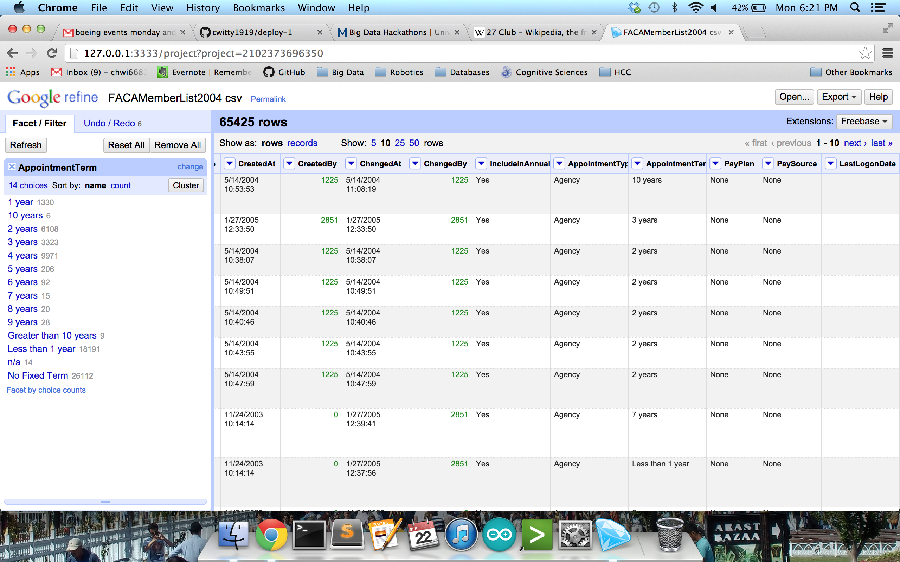
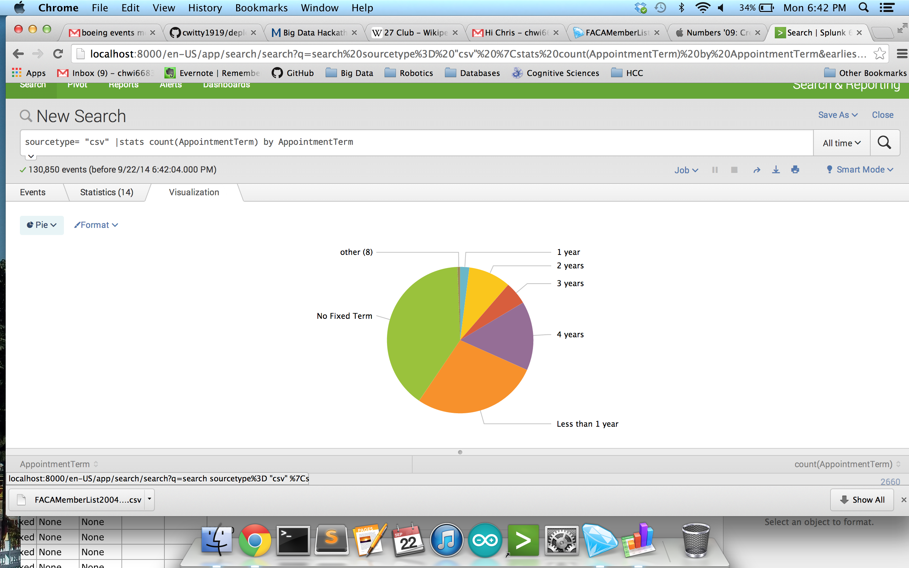
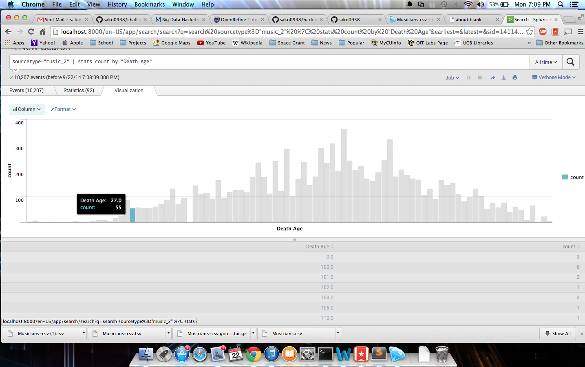

# Team Members

* [Daniel Nolan](http://github.com/dano8957)
* [Chris Wittenberg](http://github.com/cwitty1919)
* [Sam Korn](http://github.com/sako0938)
* [name-of-a-team-member](URL to this member's github account)
* [name-of-a-team-member](URL to this member's github account)

# Objective 1. Clean up the Federal Advisory Committee Dataset

## AppointmentTerm 

 

## PayPlan

 

## Data Visualization

 

# Objective 2. Clean up the Muscian Dataset

This image proves that the 27 Club does not really exist. While some artists did die at age 27, the greatest number of musicians died at age 63. The disparity between deaths at age 27 and age 63 is very large.

 
